# Beast Dash

**A self-hosted control room for the Linux box where your code and your AI agents live.**
Open it from your laptop or your phone; the machine keeps working while the laptop is closed.

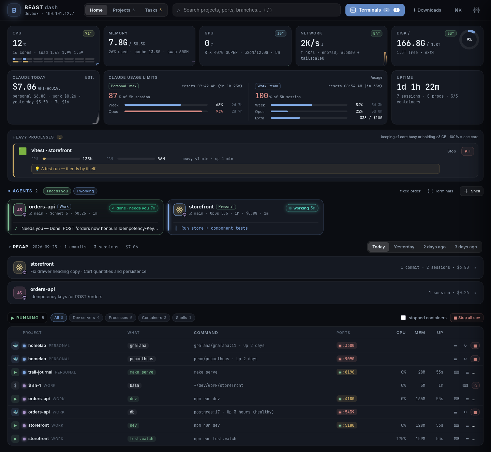

Beast Dash is one Node process with **zero npm dependencies**. Point it at the folder that holds
your projects and it gives you:

- **Every project on one screen** — discovered automatically (git repos, `package.json`,
  `pyproject`, `docker-compose`, Makefiles), grouped by the top-level folder they live in, with
  branch, uncommitted changes, last commit and the commands each one can run.
- **Claude Code sessions as cards** — which project, what it is doing right now (`working: npm test`),
  whether it is *done and waiting for you*, *needs permission* or *hit an error*, its last message,
  and a reply box. Sessions live in tmux on the server, so they run **24/7** without your laptop.
  A session waiting on its own background agents shows as *background* (which agent, doing what,
  for how long), not as idle. Busy? **⏳ Send when free** queues your message and it goes out the
  moment Claude finishes. Unsent text is kept per chat.
- **Start / stop anything** — dev servers, tests, builds, docker compose — each in its own tmux
  session with live, colour-preserving logs. A dev server that dies raises a banner and a push.
- **A terminal in the browser** (ttyd + tmux) with a phone-friendly layer: Esc/Tab/arrows/Ctrl keys,
  paste, file upload, finger scrolling. Two devices can share the same session.
- **Push notifications** to your phone and laptop when an agent finishes or needs you — tapping one
  opens that conversation, also when the app was in the background.
- **Voice input** — tap the mic, talk, Stop: transcribed on your own server with Whisper
  (optional, [below](#voice-input-whisper)); falls back to the browser's speech recognition.
- **Git without a terminal** — switch branches, stage, commit, push, read diffs, edit files.
- **Tasks** — a personal backlog of prompt-style tasks per project; "Run" hands one to a Claude
  session (or starts one).
- **Tunnels** — ports that projects bind on `127.0.0.1` are forwarded onto your Tailscale IP with
  `socat`, so `http://100.x.y.z:5173` just works from any of your devices.
- **Recap** — what happened today / yesterday / the day before, per project: your commits, the
  Claude sessions that ran (title, what you asked, files edited) and what they cost.
- **System** — CPU (per core + temperature), memory, GPU, disk, network; each tile opens a
  24-hour detail (usage + temperature charts, per-core bars). **Heavy processes** get their own card:
  what is keeping cores busy or holding GBs of memory, in words (`Android emulator · Pixel_8`,
  `vite · my-app`, `Gradle daemon`), with tips for known fixes and Stop / Kill. A push when the CPU
  runs hot, memory runs out or a process pins several cores for 10+ minutes.
- **Downloads** — `~/Downloads` on the server in a file explorer: preview images / PDFs / text,
  tick files and download one, or several (and folders) as one zip. Ask Claude to "drop the
  report in Downloads" and grab it from your phone.
- **Updates itself** — open pages reload into a new build on their own when idle.

It runs on a home server, a VPS or any Linux machine you can SSH into. No accounts, no cloud,
nothing leaves your tailnet.

### A tour

*(From a demo box: example projects, two Claude sessions, made-up usage numbers.)*

| Chat with a session | The same session in the terminal | A plain shell |
|---|---|---|
| 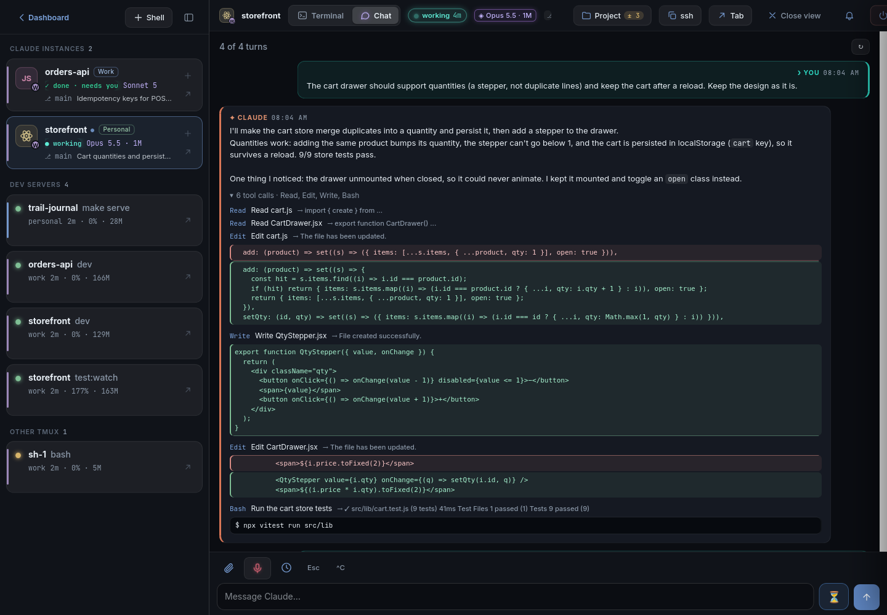 | 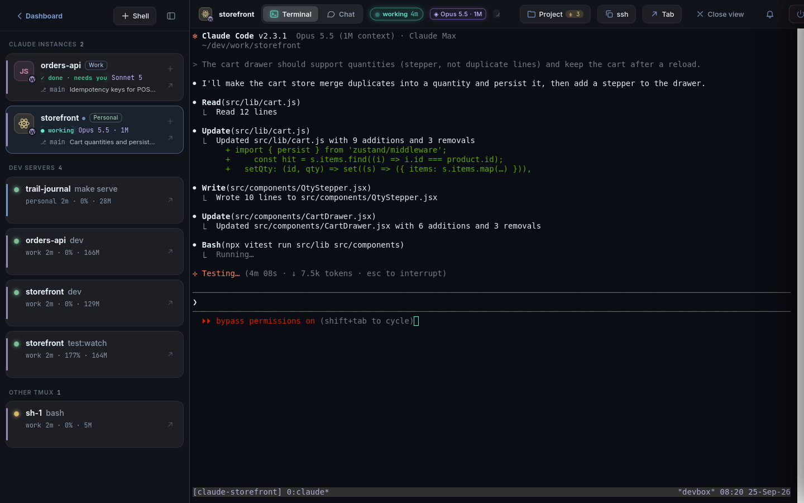 | 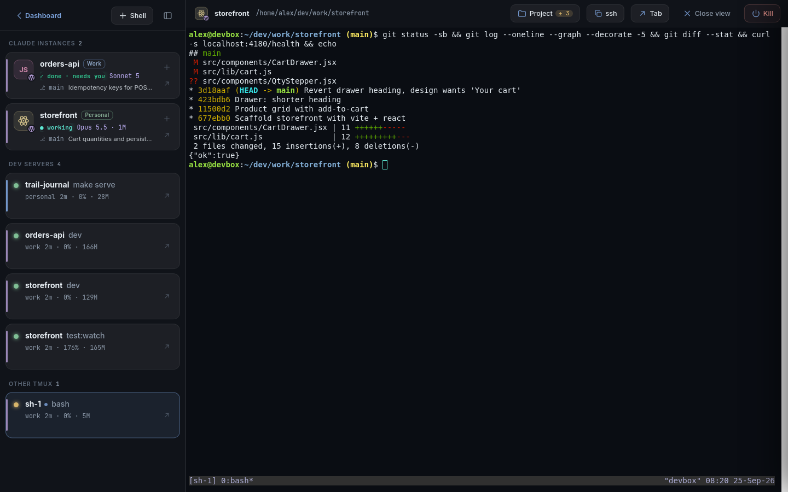 |
| **Changes: diff, stage, commit, push** | **Files: tree, preview, edit in place** | **Downloads: preview, tick, download as zip** |
| 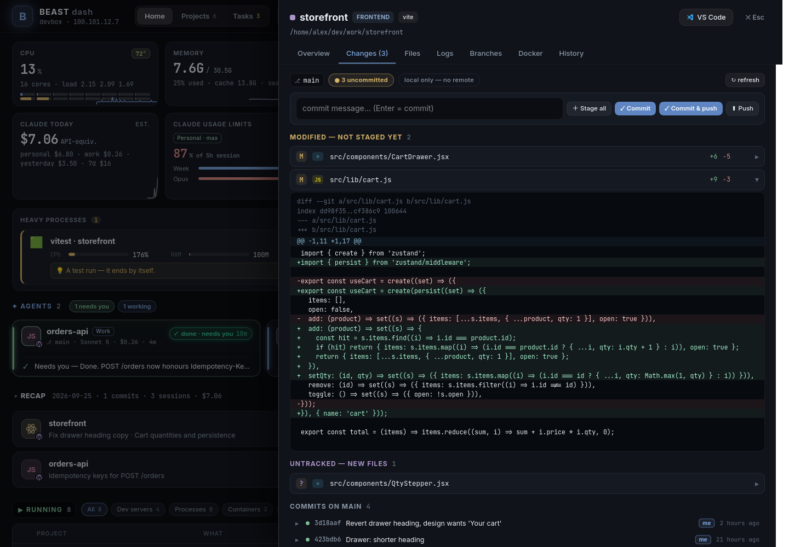 | 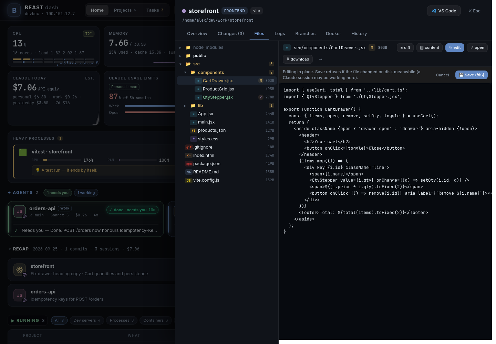 | 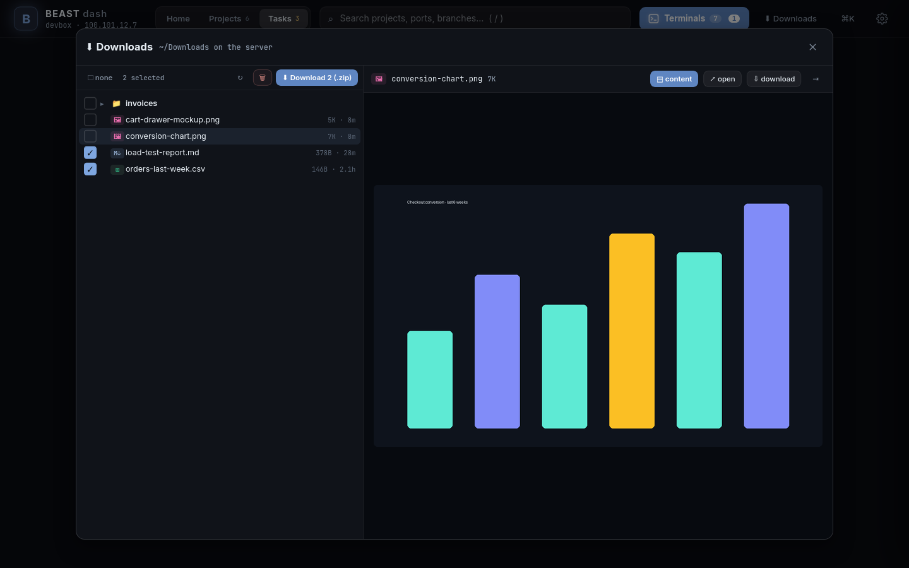 |
| **Projects** | **Tasks** | **⌘K** |
| 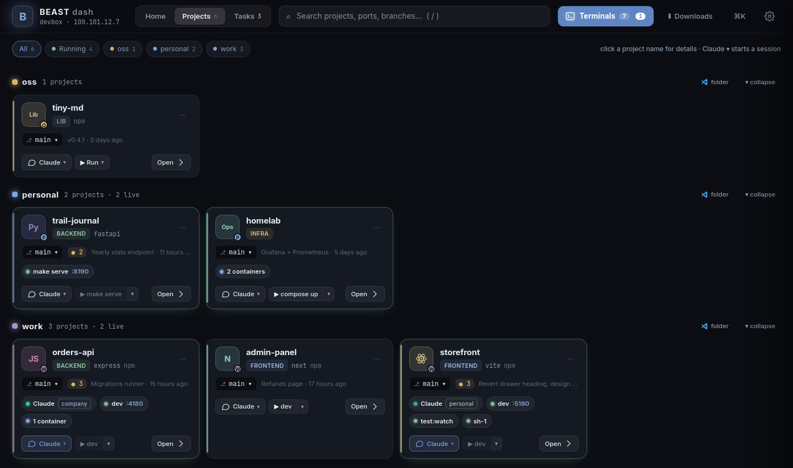 | 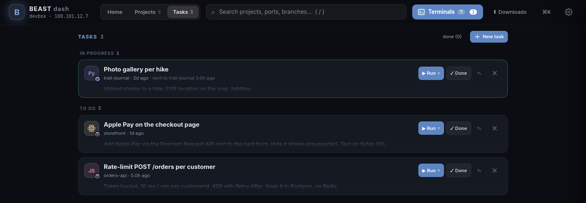 | 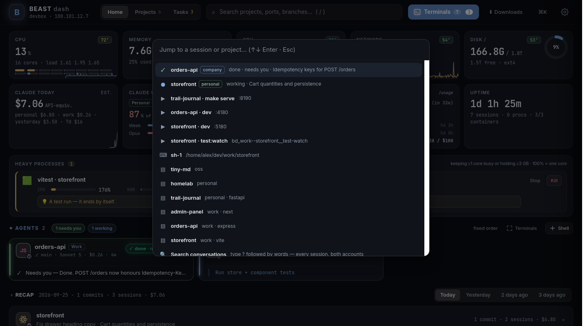 |

**On the phone** — home, chat, terminal, a diff, Downloads:

<p>
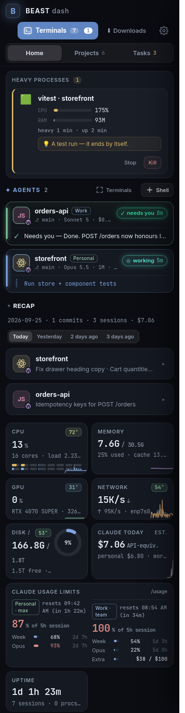
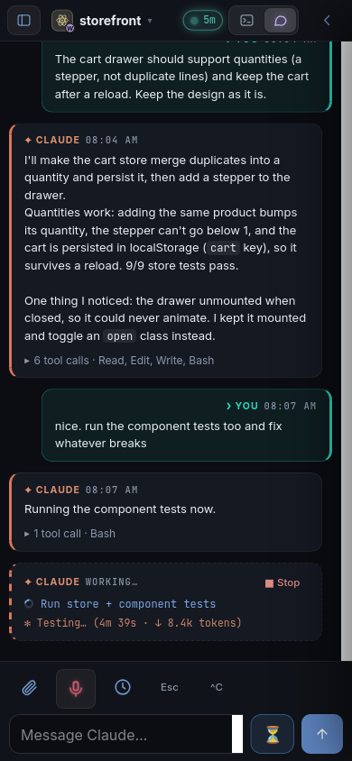
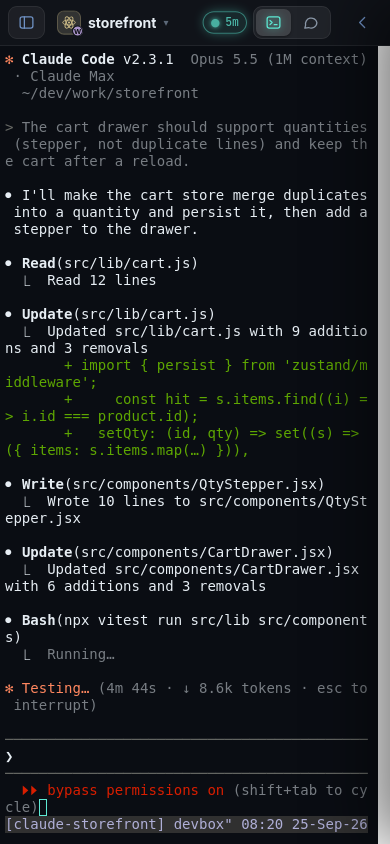
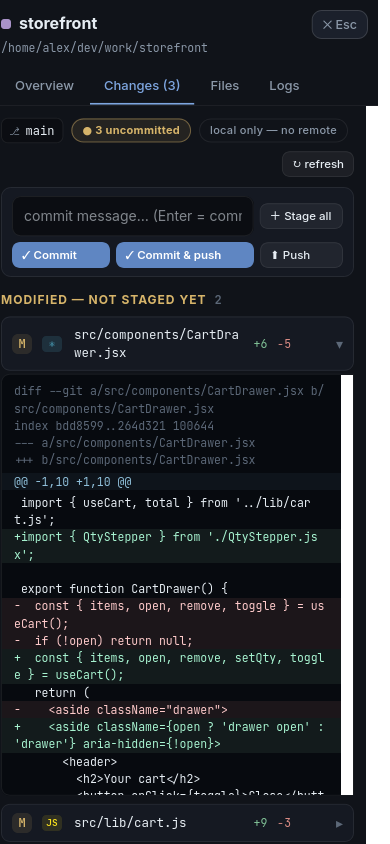
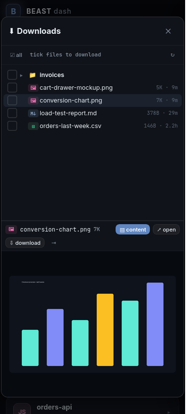
</p>

---

## Who this is for

You keep your repositories on one always-on Linux machine and work on them from wherever you are.
You run one or more **Claude Code** sessions on it and want to see at a glance what each one is
doing, answer a permission prompt from the phone, start the dev server, check a diff, and get a
push when an agent is done — without opening a laptop or juggling SSH windows.

If that is you, Beast Dash is the page you leave open.

## Requirements

- Linux with **systemd** (Ubuntu/Debian/Fedora/Arch … — the installer uses `systemctl --user`)
- **Node 18+** (developed on 24) — no `npm install` needed
- **tmux** — required; every command the dashboard runs lives in a tmux session
- **Tailscale** on the server and on your devices — the intended way to reach it (see *Access*)

Optional, each one unlocks a feature and is skipped cleanly when missing:

| Tool | Gives you |
|---|---|
| `ttyd` | the terminal in the browser |
| `git` | branch / changes / commits on the cards |
| `socat` | automatic port forwarding onto the tailnet |
| `docker` | container list, compose up/down, container logs |
| `jq` | smaller Claude hook payloads (falls back to a size cap) |
| `nvidia-smi` | the GPU tile |
| `python3` | the "⌨ Shell" button reads `devRoot`; icon regeneration |
| **Claude Code** | the agent cards, transcript view, usage limits |

```bash
sudo apt install tmux git socat ttyd jq     # Debian / Ubuntu
```

## Quick start

```bash
git clone https://github.com/zbla92/beast-dashboard.git ~/beast-dash
cd ~/beast-dash
./install.sh
```

The installer writes two `systemd --user` units (dashboard + terminal), starts them, registers the
Claude Code hooks, enables *linger* (so the services survive logout) and — if `tailscale` and
`ufw` are both present — allows the tailnet interface through the firewall. It prints the URL at
the end, normally `http://<tailscale-ip>:8787`.

Open it, click ⚙ **Settings**:

1. **Projects folder** (`devRoot`) — where to scan. Default `~/dev`. The first folder level below
   it becomes the "org" grouping (`~/dev/acme/web` → org *acme*, project *web*).
2. **SSH host alias** — the name of this server in `~/.ssh/config` on your laptop. It makes the
   *VS Code* button open the folder over Remote-SSH and the *copy ssh command* actions work.

That is the whole setup. Everything else has defaults.

To try it without installing anything: `node server.js` and open `http://localhost:8787`.

## Access — read this before exposing anything

**There is no login screen.** The dashboard runs commands and opens shells as your user; whoever
can reach the port owns the machine. Its only protection is *who can connect*:

- requests from `127.0.0.1` and from the **Tailscale** range (`100.64.0.0/10`, `fd7a:115c:a1e0::/48`)
  are accepted;
- everything else gets `403`.

So the model is: install Tailscale on the server and on your phone/laptop, and reach the dashboard
at `http://100.x.y.z:8787` from anywhere in the world, over WireGuard, with no port open to the
internet. That is what it was built for.

**No Tailscale?** Use an SSH tunnel and open `http://localhost:8787`:

```bash
ssh -L 8787:localhost:8787 -L 7681:localhost:7681 myserver
```

Another private network (a WireGuard net, a LAN)? Add its prefix to `allowedPrefixes` in
`state/settings.json`, e.g. `["10.8.0."]`. Do **not** put the dashboard on a public IP or behind
a plain reverse proxy.

### On a VPS

Same steps. `./install.sh` works on any systemd distro as an unprivileged user; it needs `sudo`
twice (linger + the ufw rule) and tells you if it can't. Tailscale on the VPS + Tailscale on the
phone is the whole networking story — the VPS firewall can stay closed except for SSH.

## HTTPS, push notifications and the phone

Push notifications and "Add to Home Screen" as a real app need a secure origin. Tailscale gives
you one for free:

1. Once, in the Tailscale admin console: **DNS → HTTPS Certificates → Enable**.
2. On the server: `./bin/enable-https.sh` — sets up `tailscale serve` so that
   `https://<server>.<tailnet>.ts.net/` is the dashboard and `/term/` is the terminal, on one
   origin. Tailnet-only; nothing is published to the internet.
3. Open the HTTPS URL on the phone and laptop → ⚙ Settings → **Push → Enable on this device**.

Plain `http://<ip>:8787` keeps working; only push and the installable app need HTTPS.

On iPhone, add the page to the Home Screen (Share → Add to Home Screen): you get a full-screen
app, notifications, and the terminal with a key bar above the keyboard.


## Claude Code

Beast Dash treats Claude Code sessions as first-class citizens.

**Starting one.** On a project card, **✦ Claude ▾** creates a tmux session `claude-<project>`
in that folder running `claude --dangerously-skip-permissions` and opens it in the browser
terminal. Two Claude Code logins are supported: the default `~/.claude`, and a second one kept in
`~/.claude-company` (started with `CLAUDE_CONFIG_DIR`, session `claude-<project>-company`). What
they are called on the cards is yours — ⚙ Settings → *Claude accounts* (e.g. "Me" / "Work"). The
second one is optional; if the folder doesn't exist, nothing mentions it. More than one session per project:
*Another instance* or *in a git worktree…* (`claude --worktree`), so two agents never edit the same
files.

**Knowing what it's doing.** `bin/install-hooks.js` registers `bin/claude-hook.sh` as a Claude Code
hook (SessionStart, UserPromptSubmit, PreToolUse, PermissionRequest, Notification, Stop,
StopFailure, SessionEnd). Every event is POSTed to the dashboard tagged with the tmux session, so a
card knows within milliseconds that its agent is running `npm test`, waiting for a `y`, or done.
As a fallback the pane itself is read (`tmux capture-pane`). Sessions you started by hand inside
tmux are picked up too.

**Talking to it.** Type in the reply box on the card (from the phone, without a terminal), or open
the session in **Chat** mode — the conversation rendered from the transcript: your messages on
the right, Claude's on the left, tool calls collapsed per turn (expand them for the Edit / Write
diffs and the Bash commands), and while Claude works a live turn with what it is running and its
own status line (`✻ Testing… 4m 08s · ↓ 7.5k tokens`) plus ■ Stop. *Files edited* links to the
diffs. `Esc`, `^C`, `y`/`n` are one tap away. **Terminal** mode is the same session as the real
Claude Code TUI; the switch is one per device.

**Scheduling.** ⏰ on a session: send a prompt (or a chain of prompts — each waits for the previous
one to finish) at a given time. Combine with **Tasks**: write yourself prompt-style tasks with
attachments, then *Run* one — or *Run all* open tasks of a project, chained on one session — while
you're away. When Claude finishes, its closing summary lands on the task (*Needs your review →
Accept / Done*), and the push notification can be answered with a quick reply.

**Cost and limits.** *Claude today* prices the tokens in the local transcripts at API list price
(on a subscription nothing is billed per token — it measures how much work the agents did). *Usage
limits* shows the same 5-hour / 7-day windows as `/usage` inside Claude Code. For that it reads the
OAuth token Claude Code keeps in `~/.claude/.credentials.json` and asks Anthropic's usage
endpoint — the token is never sent anywhere else and never refreshed by the dashboard.

**After a reboot.** Sessions are remembered (`state/claude-sessions.json`); a banner offers
*Restore all* (`claude --resume <id>` in the same folder), or set *auto-restore* in Settings.
The card also shows ↻ when a newer Claude Code is installed; one click restarts the session on it.

**Search.** `⌘K` then `? words` searches every past conversation on the machine; open one
read-only and *Resume here*.

## Everyday use

- **Home** — system tiles, the agents that need you first, the day's recap, and the running
  table (dev servers, processes started by hand, containers) with ports, CPU, memory, logs,
  restart, stop. On a phone the agents come first and chat is the default view of a session.
- **Projects** — cards grouped by org. ▶ runs the primary command; ▾ lists every script /
  Makefile target / compose action / your own custom commands. *Open* → the drawer: Overview,
  Changes (stage · commit · push, diffs), Files (tree, diffs, editor), Logs, Branches, Docker,
  History.
- **Tasks** — your backlog, per project, with attachments that survive restarts.
- **Terminals** — the terminal panel with a session list; `t`, `n` (next session that needs you),
  `s` (new shell), `1-9` switch. Inside a terminal: `Ctrl+Shift+←/→` switch, `Ctrl+Shift+↑` back.
- **⌘K / Ctrl+K** — jump to any session or project, start Claude, run actions, search conversations.

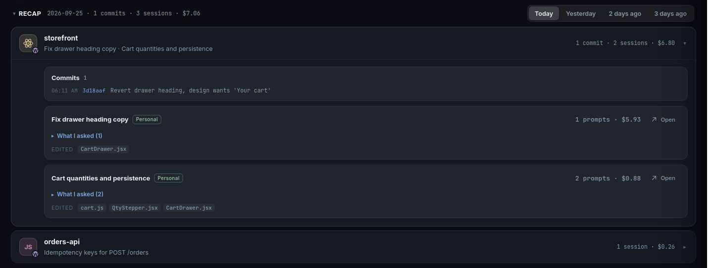

- **Tunnels** (⚙ → Tunnels) — loopback-only ports of running projects are forwarded onto the
  Tailscale IP automatically; *Rebuild all* after a resume; manual expose for anything else.
  `mac/beast-tunnel.sh` is the optional laptop-side `ssh -L` helper for the rare service that
  must be `localhost`.
- **Menubar** — `mac/beast-menubar.sh` is an xbar/SwiftBar plugin: how many agents need you,
  right in the macOS menubar.

## Configuration

Everything lives in `state/` (gitignored) and is edited through ⚙ Settings, which writes
`state/settings.json`. The keys and their defaults are in [`lib/settings.js`](lib/settings.js):

| Key | Default | What |
|---|---|---|
| `devRoot` | `~/dev` | folder to scan for projects |
| `scanDepth` | `4` | how deep to look |
| `port` | `8787` | HTTP port |
| `sshHost`, `sshUser` | `''` | your laptop's ssh alias for this server (VS Code links, copied commands) |
| `publicHost` | auto | host used in generated links (defaults to the Tailscale IPv4) |
| `allowedPrefixes` | `[]` | extra client IP prefixes to accept, e.g. `["10.8.0."]` |
| `autoExpose` | `true` | forward loopback ports onto the tailnet with socat |
| `autoRestore` | `false` | bring Claude sessions back automatically after a reboot |
| `accountLabels` | `{personal: 'Personal', company: 'Company'}` | display names of the two Claude logins (`~/.claude`, `~/.claude-company`) |
| `pushContact` | `mailto:admin@example.com` | VAPID contact sent to push services — set it to yours |
| `notify` | all on | which events push, quiet hours |
| `serverName` | hostname | name in system push titles (*"myserver CPU 92 °C"*) |
| `voiceLangs` | `[]` | languages the mic toggles between, e.g. `["en", "de"]` (first = default); empty = auto |

Per-project overrides (hide, rename, custom commands, pin) are set from the card's ⋯ menu.

Nightly, `state/` is tarred into `state-backups/` (also gitignored) — download from Settings.
**Keep both folders out of git**: `state/push.json` holds the VAPID private key and your push
subscriptions.

## Voice input (Whisper)

Optional. `bin/setup-whisper.sh` makes `whisper/.venv` with [faster-whisper](https://github.com/SYSTRAN/faster-whisper)
(plus the CUDA 12 libraries when there is an NVIDIA GPU) and installs the `beast-whisper` user unit. It is
**not** started at boot: pressing the mic starts it (the model loads in 1–3 s while you already talk — the
recording is buffered), and it exits a minute after the last use, so the GPU isn't held.

- Settings in `whisper/whisper.env` (from `whisper.env.example`): model, device (`auto` = GPU if there is one,
  else CPU int8 — use `small` there), the languages you speak (detection never picks a third one), a prompt
  with your jargon, regex fixes for words it keeps mishearing.
- On a GPU (`large-v3-turbo`) a 30 s recording transcribes in well under a second; idle, the loaded model
  costs a few hundred MB of RAM and ~2 GB of VRAM, nothing else.
- The recording sheet covers the page: *Starting mic…* until the microphone is really live, then a beep —
  iOS takes a moment (and home-screen apps ask for the mic again after being killed).

Without it the mic uses the browser's own speech recognition (Safari / Chrome).

## How it fits together

```
server.js            HTTP + SSE API, one tick loop (fast while someone is watching, slow when not)
lib/discovery.js     scans devRoot, classifies projects, finds their commands
lib/runtime.js       processes, ports, tmux sessions, containers — attributed to projects
lib/actions.js       start/stop/restart in tmux, Claude sessions, shells
lib/claude.js        session state from hooks + pane; restore after reboot
lib/usage.js         transcript cost        lib/limits.js   plan limits
lib/schedule.js      timed prompts          lib/tasks.js    task backlog
lib/gitinfo.js       git status/diffs       lib/files.js    file tree / editor
lib/expose.js        socat forwards         lib/push.js     Web Push (VAPID + aes128gcm, no deps)
lib/health.js        port health            lib/sys.js      system stats (24 h history)
lib/recap.js         per-day recap from git log + transcripts
public/              the UI — vanilla JS, one file
term/                ttyd's page + the phone layer (build with bin/build-term-index.sh)
bin/                 hook script + installer, HTTPS setup, terminal entrypoint, icon generator
```

The dashboard never runs a command in its own process: everything goes through
`tmux new-session … bash -ic`, so `nvm`, `.bashrc` and your environment are exactly what a manual
terminal would have, and it all keeps running if the dashboard restarts.

## Setting it up with an AI agent

[AGENT-SETUP.md](AGENT-SETUP.md) is written for Claude Code (or any agent) doing the installation on
a machine that is not the author's: what to ask the user first, the access model, every step with
its verification, and what to say when something is missing. Point your agent at it:

> Read AGENT-SETUP.md in this repo and install Beast Dash on this machine.

## Uninstall

```bash
./install.sh --uninstall          # stops and removes the two services
node bin/install-hooks.js --remove   # takes the hook out of Claude Code's settings
./bin/enable-https.sh off         # if you set up tailscale serve
```

## License

MIT.
